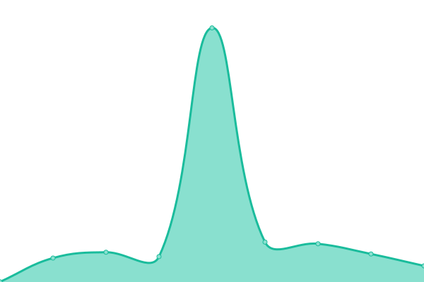
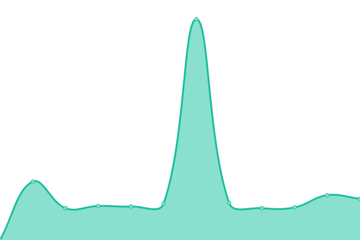

# [📈 Live Status](https://DiSilvioRiccardo.github.io/cobru-status): <!--live status--> **🟩 All systems operational**

This repository contains the open-source uptime monitor and status page for [DiSilvioRiccardo](https://DiSilvioRiccardo.github.io/cobru-status), powered by [Upptime](https://github.com/upptime/upptime).

With [Upptime](https://upptime.js.org), you can get your own unlimited and free uptime monitor and status page, powered entirely by a GitHub repository. We use [Issues](https://github.com/DiSilvioRiccardo/cobru-status/issues) as incident reports, [Actions](https://github.com/DiSilvioRiccardo/cobru-status/actions) as uptime monitors, and [Pages](https://DiSilvioRiccardo.github.io/cobru-status) for the status page.

<!--start: status pages-->
<!-- This summary is generated by Upptime (https://github.com/upptime/upptime) -->
<!-- Do not edit this manually, your changes will be overwritten -->
<!-- prettier-ignore -->
| URL | Status | History | Response Time | Uptime |
| --- | ------ | ------- | ------------- | ------ |
|  [Prod Cobru](https://prod.cobru.co) | 🟩 Up | [prod-cobru.yml](https://github.com/trixel/cobru-status/commits/HEAD/history/prod-cobru.yml) | 

 3202ms
     
 | 

<a href="https://trixel.github.io/cobru-status/history/prod-cobru">100.00%</a>
    

|  [Dev Cobru](https://dev.cobru.co) | 🟩 Up | [dev-cobru.yml](https://github.com/trixel/cobru-status/commits/HEAD/history/dev-cobru.yml) | 

 3239ms
     
 | 

<a href="https://trixel.github.io/cobru-status/history/dev-cobru">100.00%</a>
    

|  [Cobru Panel](https://panel.cobru.co) | 🟩 Up | [cobru-panel.yml](https://github.com/trixel/cobru-status/commits/HEAD/history/cobru-panel.yml) | 

 249ms
     
 | 

<a href="https://trixel.github.io/cobru-status/history/cobru-panel">100.00%</a>
    

|  [Cobru Panel Dev](https://dev.panel.cobru.co) | 🟩 Up | [cobru-panel-dev.yml](https://github.com/trixel/cobru-status/commits/HEAD/history/cobru-panel-dev.yml) | 

 226ms
     
 | 

<a href="https://trixel.github.io/cobru-status/history/cobru-panel-dev">100.00%</a>
    

|  [Descarga de Cobru](https://cobru.co/descargar) | 🟩 Up | [descarga-de-cobru.yml](https://github.com/trixel/cobru-status/commits/HEAD/history/descarga-de-cobru.yml) | 

 1762ms
     
 | 

<a href="https://trixel.github.io/cobru-status/history/descarga-de-cobru">100.00%</a>
    

<!--end: status pages-->

[**Visit our status website →**](https://DiSilvioRiccardo.github.io/cobru-status)

## 📄 License

- Powered by: [Upptime](https://github.com/upptime/upptime)
- Code: [MIT](./LICENSE) © [DiSilvioRiccardo](https://DiSilvioRiccardo.github.io/cobru-status)
- Data in the `./history` directory: [Open Database License](https://opendatacommons.org/licenses/odbl/1-0/)
